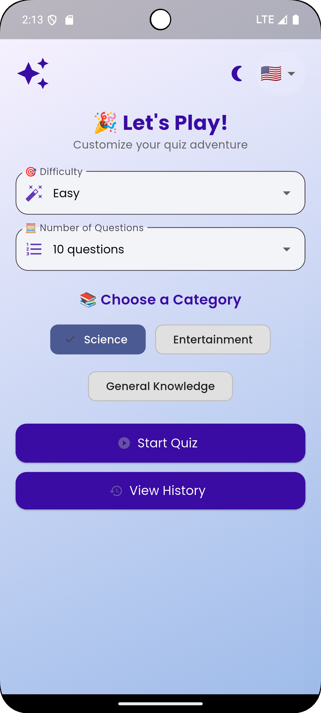
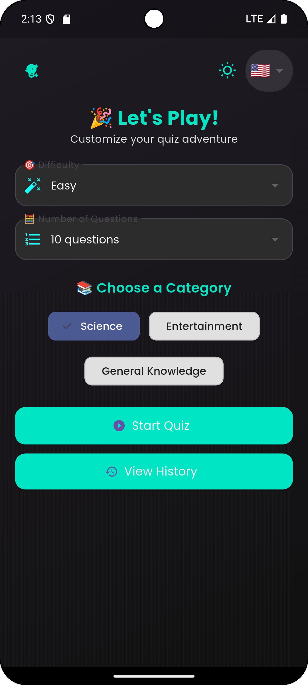
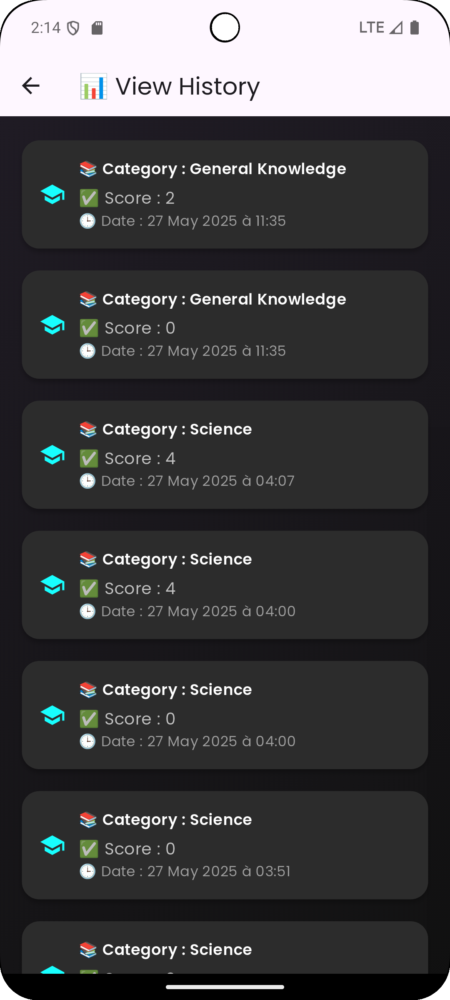

# 🎯 QuizMaster Pro

<div align="center">


</div>

---

## 📱 About the App

**QuizMaster Pro** is a modern, multilingual quiz application built with **Flutter** and powered by **Firebase**. It offers an engaging quiz experience enhanced with real-time feedback, sound effects, score tracking, and push notifications — all wrapped in a beautiful and responsive interface.

---

## ✨ Key Features

- 🎮 **Interactive & Thematic Quiz Interface**
- 🔐 **Firebase Authentication** (Email/Password, Anonymous)
- 🔊 **Sound Feedback** on Answers
- ⏱️ **Countdown Timer** per Question
- 🎉 **Confetti Effects** for Celebration
- 🌍 **Multi-language Support**: English, Français, العربية
- 📈 **Score History Tracking** (Firestore)
- 🌙 **Theme Switcher** (Light / Dark Mode)
- 🔔 **Push & Local Notifications** (FCM + flutter_local_notifications)
- 💾 **Local Persistence** with SharedPreferences
- 📱 **Responsive Layout** for all screens

---

## 🛠️ Tech Stack

| Tool | Description |
|------|-------------|
| **Flutter** | Cross-platform UI toolkit |
| **Dart** | Programming language |
| **Firebase** | Backend services (Auth, Firestore, FCM) |
| **Riverpod** | State management |
| **Shared Preferences** | Local data storage |
| **Confetti** | Visual celebration |
| **Audio Players** | Sound effects |
| **Google Fonts** | Custom typography |
| **intl** | Localization |
| **flutter_local_notifications** | Local notifications |
| **firebase_messaging** | Push notifications |

---

## 🖼️ Screenshots

| Light Mode | Dark Mode | Multilingual Support |
|------------|-----------|----------------------|
|  |  |  |

---

## 📁 Project Structure

```
lib/
├── controller/    # Business logic & state management
├── l10n/          # App localization files
├── model/         # Data models
├── screens/       # Main UI screens
├── service/       # Firebase & API integrations
├── widget/        # Reusable UI components
└── main.dart      # Entry point
```

---

## 🚀 Getting Started

### 🔧 Prerequisites

- [Flutter SDK 3.x](https://flutter.dev/docs/get-started/install)
- [Dart SDK](https://dart.dev/get-dart)
- [Firebase Account](https://firebase.google.com/)
- Android Studio / VS Code

### 🔥 Firebase Setup

1. Go to [Firebase Console](https://console.firebase.google.com)
2. Create a new project and add Android/iOS apps
3. Enable:
   - **Authentication** (Email/Password or Anonymous)
   - **Cloud Firestore**
   - **Firebase Cloud Messaging (FCM)**
4. Download `google-services.json` and place it in `android/app/`
5. Optionally, download `GoogleService-Info.plist` for iOS

### ⚙️ Android Configuration

Add to `android/app/build.gradle`:

```gradle
compileOptions {
    sourceCompatibility JavaVersion.VERSION_1_8
    targetCompatibility JavaVersion.VERSION_1_8
    coreLibraryDesugaringEnabled true
}

dependencies {
    implementation "com.android.tools:desugar_jdk_libs:2.0.3"
}
```

### 🛠 Installation

1. Clone the repository

```bash
git clone https://github.com/YessineELEUCHI/QuizMaster-Pro.git
cd QuizMaster-Pro
```

2. Install dependencies

```bash
flutter pub get
```

3. Run the app

```bash
flutter run
```

---


## 👨‍💻 Author

**Yessine ELEUCHI**  
📧 yessineleuchi.embedded@gmail.com  
🔗 [GitHub](https://github.com/YessinEleuchi)

---

<div align="center">
Made with ❤️ and Flutter by <strong>Yessine ELEUCHI</strong>
</div>
